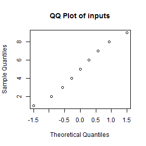
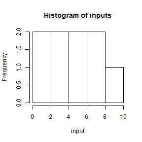

## What is the EDAinator?

 * The EDA is designed to take a list of numbers and do some quick Exploratory Data Analysis.
 * It is designed particularly for Excel.  Often I (and maybe you) will receive an Excel sheet, and the first thing I want to do is get a general picture about the columns.
  * This can take some time to fire up R or write the proper functions in Excel.
  * With the EDAinator, I can start it, select a row, copy it, and get my basic results. 

--- .class #id 

### What does the EDAinator do?
 * The EDAinator will take a list of numbers, convert it to vector, and do the following:
  * Compute summary statistics such as the mean, quantiles, etc.
  * Generate a QQ plot
  * Generate a Histogram
  
### How does it work?
 * Select some numbers from an Excel worksheet column.
 * Copy them to your clipboard.
 * Paste them into the Text box provided by the EDAinator.
 * Gain a numerical epiphany regarding your data.

---

## Give it a try
 * Go [here](https://jamesbullis.shinyapps.io/EDAinator)
 * Entering:  1 2 3 4 5 6 7 8 9 in the text input will produce the equivalent output


```
##    Min. 1st Qu.  Median    Mean 3rd Qu.    Max. 
##       1       3       5       5       7       9
```

  


---

## The fine print
### Limitations
 * The EDAinator only takes numbers separate by spaces at the moment
 * When pasting from Excel, the EDAinator only accepts columns
 * The EDAinator only generates a QQ plot agains the normal distribution

### Future Directions
 * Add support for comma separated, tab separated, semi-colon separated values.
 * Add tests for other distributions:
  * Poisson
  * Hypergeometric
  


